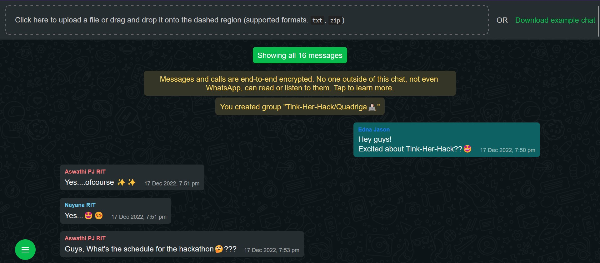

# Tink-Her-Hack_Project  
**Deployed app link** : https://spectacular-clafoutis-6b6df9.netlify.app/     
**Our project implementation video**: https://www.loom.com/share/0ecc7c512a534f2e9cb7ce564a7cd93d

# Quadriga-Whatsapp_Chat_Viewer
&emsp;&emsp;This project provides an efficient way to export chats from WhatsApp in a convenient and readable form. This makes it easier to check out your chat history.  
## Other functionalities
1. A range for the number of messages can be set in order to obtain only the required messages.
2. In case of group chats, the messages can be viewed in any of the members point of view.  
## How it works?
&emsp;&emsp;The required chat need to be exported from WhatsApp. The exported chat which would be in a text file format must be converted to a zip file. This zip file can then be placed at the dropzone of the site which would give the readable form of the exported chat. The range of the messages can be adjusted in the side panel. It also provides an option to choose the user whose point of view the chat is in.  

 ## How to upload locally  
 
 Step 1:Clone this repo locally  
 Step 2:Install react   
 Step 3:Run the command npm i react-scripts  
 Step 4:Run the command npm start to run the application   
 
 ## Tech stacks used  
 reactjs  
 javascript(modules:whatsapp-chat-parser, jszip, react-scripts..)  
 
 
  

## How to Export Chat

For android refer -https://faq.whatsapp.com/1180414079177245/?locale=en_US&cms_platform=android  
For iphone refer -https://faq.whatsapp.com/902477924463699/?locale=en_US&cms_platform=iphone

